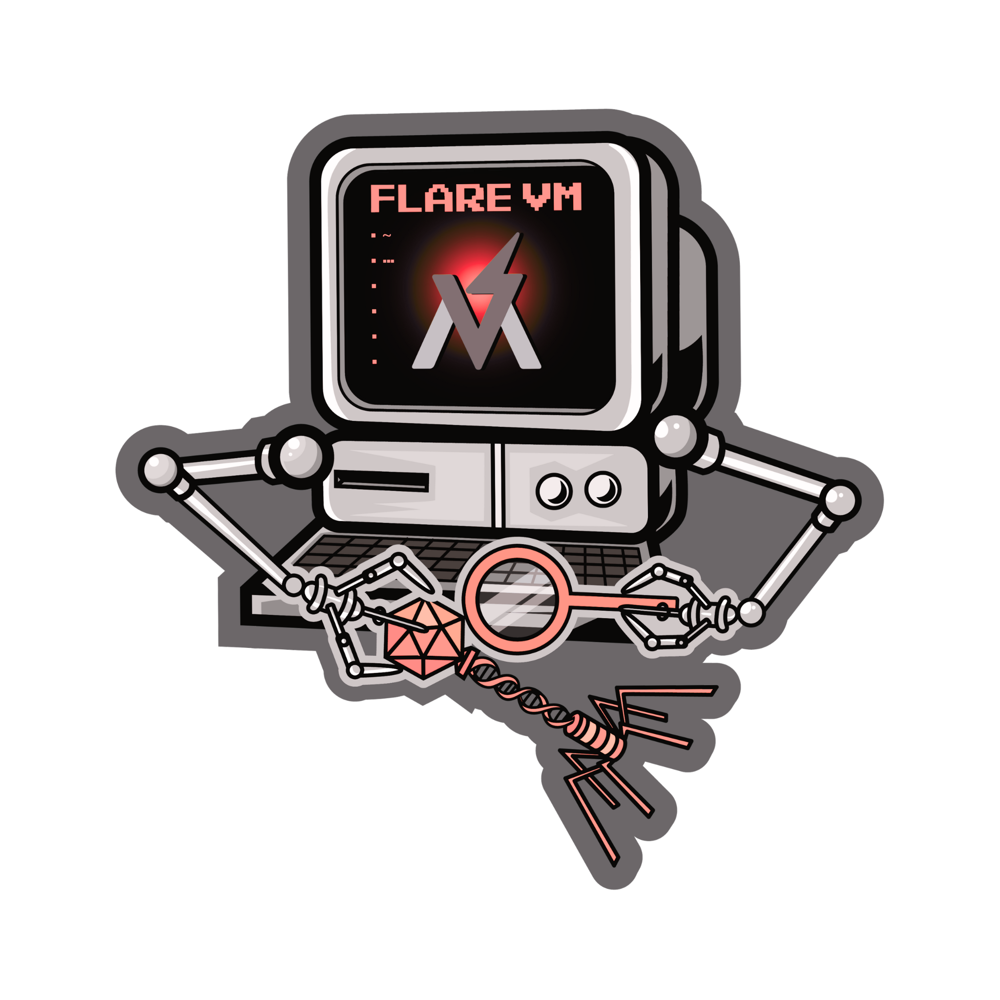
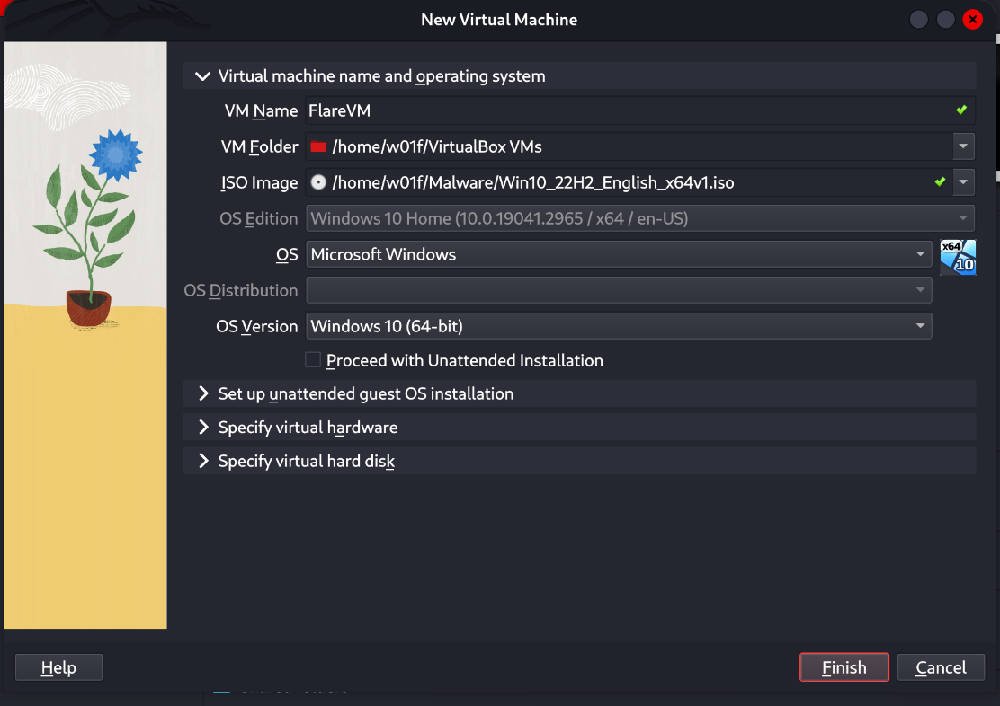
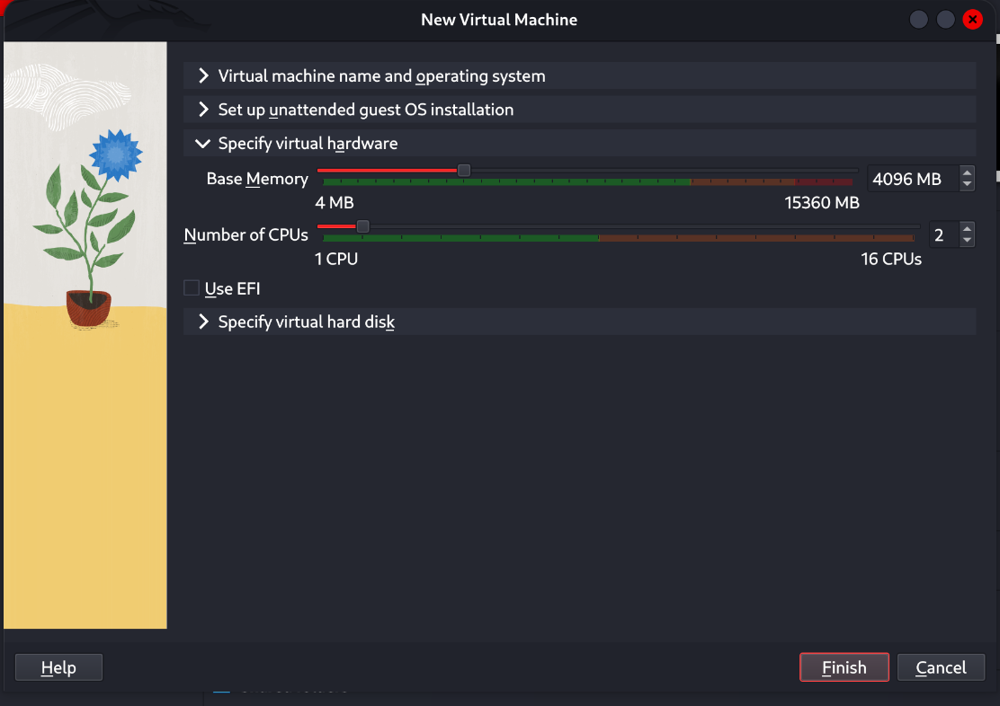
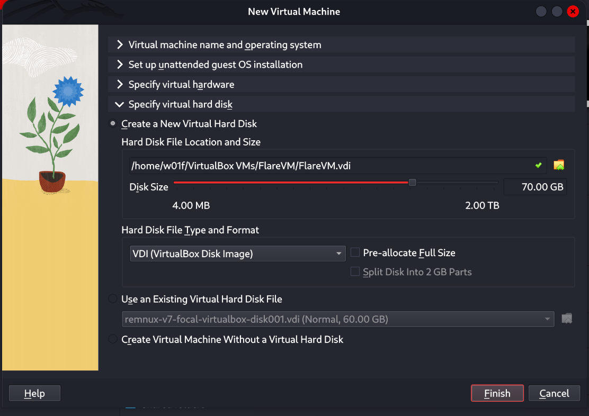
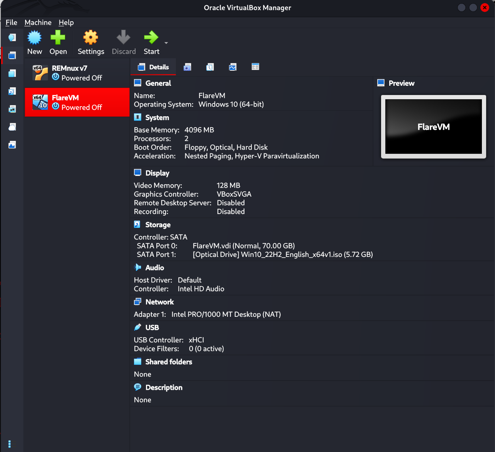
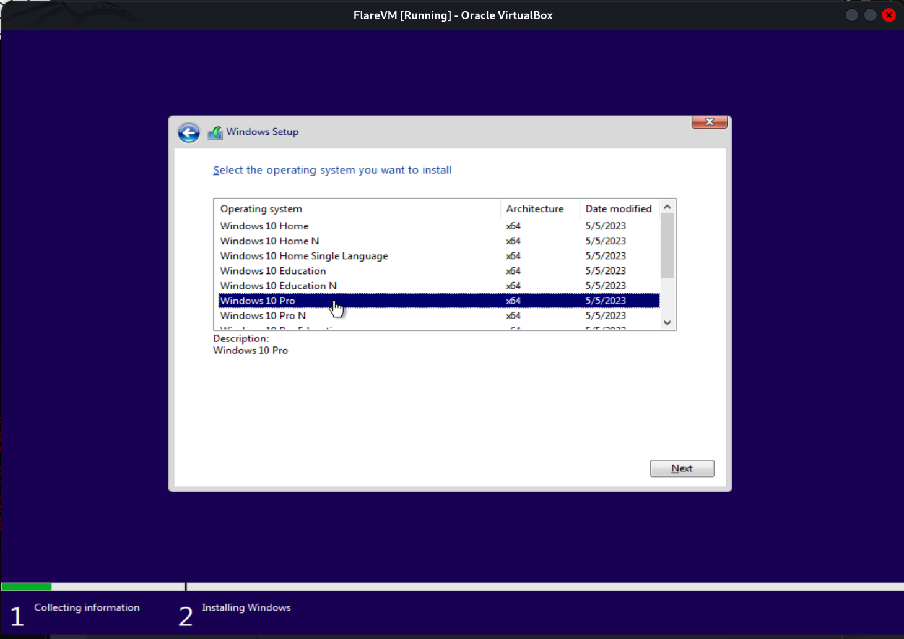
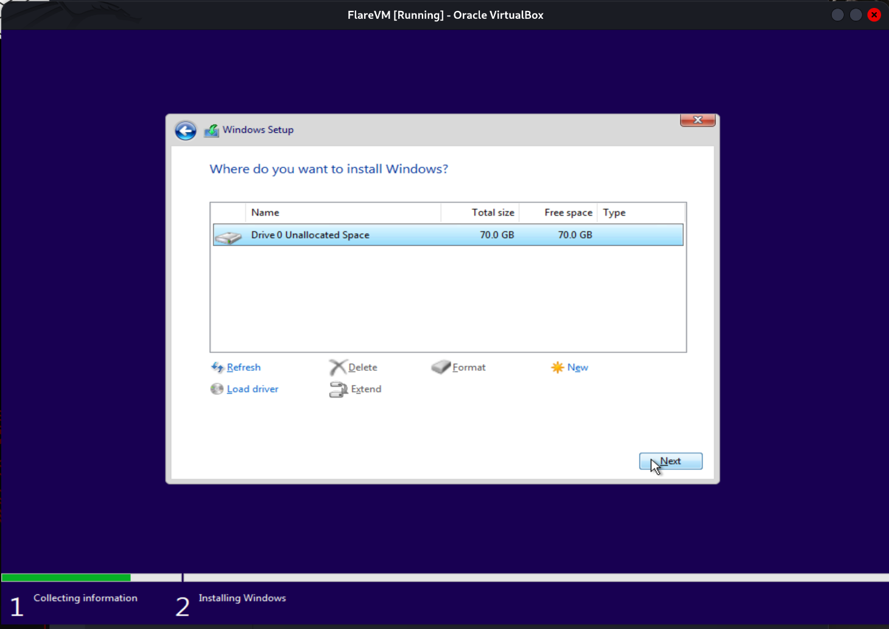
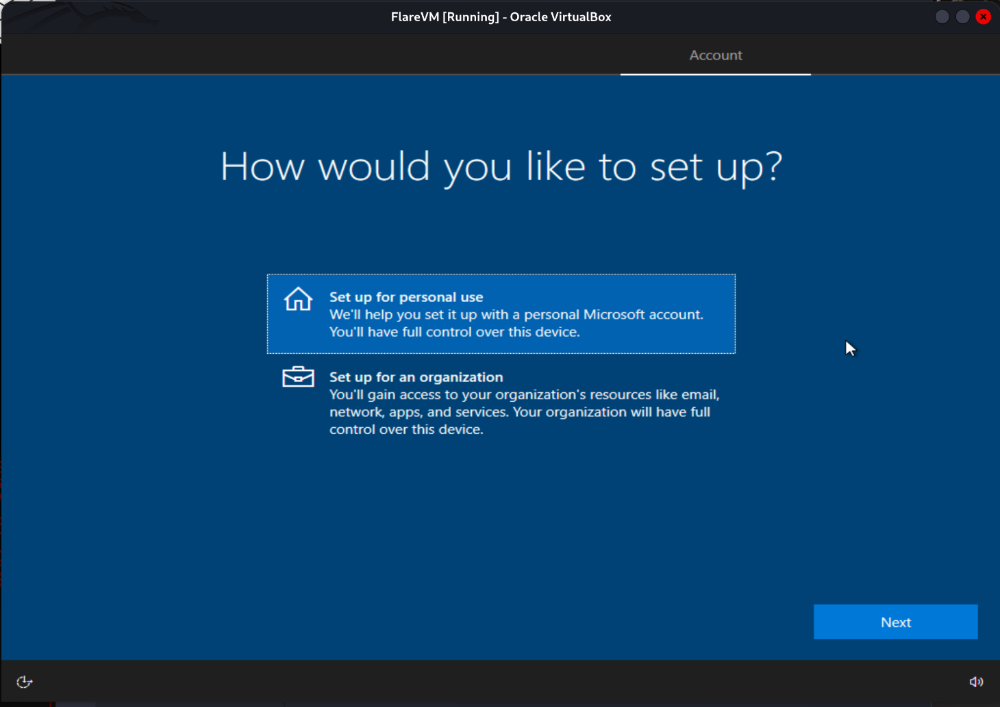
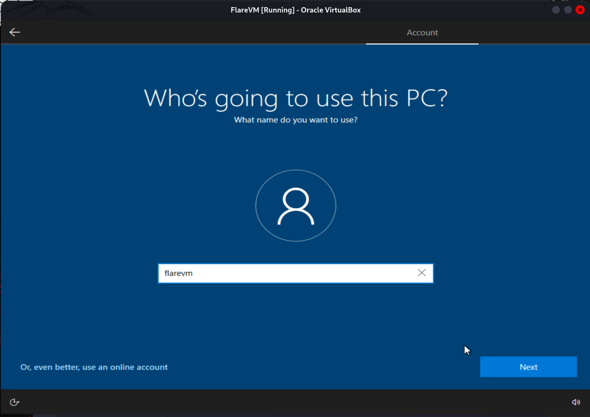

# FLARE-VM
Welcome to FLARE-VM - a collection of software installations scripts for Windows systems that allows you to easily setup and maintain a reverse engineering environment on a virtual machine (VM). FLARE-VM was designed to solve the problem of reverse engineering tool curation and relies on two main technologies: [Chocolatey](https://chocolatey.org) and [Boxstarter](https://boxstarter.org). Chocolatey is a Windows-based Nuget package management system, where a "package" is essentially a ZIP file containing PowerShell installation scripts that download and configure a specific tool. Boxstarter leverages Chocolatey packages to automate the installation of software and create repeatable, scripted Windows environments.

<p align="center">
  
</p>

## Requirements
**FLARE-VM should ONLY be installed on a virtual machine**.
The VM should satisfy the following requirements:

* Windows ≥ 10
* PowerShell ≥ 5
* Disk capacity of at least 60 GB and memory of at least 2GB
* Usernames without spaces or other special characters
* Internet connection
* Tamper Protection and any Anti-Malware solution (e.g., Windows Defender) disabled, preferably via Group Policy
* Windows Updates Disabled

## Installation instruction
This section documents the steps to install FLARE-VM. You may also find useful the [_Building a VM for Reverse Engineering and Malware Analysis! Installing the FLARE-VM_ video](https://www.youtube.com/watch?v=i8dCyy8WMKY).

### Pre-installation
* Prepare a Windows 10+ virtual machine
  * Install Windows in the virtual machine, for example using the raw Windows 10 ISO from https://www.microsoft.com/en-us/software-download/windows10ISO
  * Ensure the [requirements above](#requirements) are satisfied, including:
    * Disable Windows Updates (at least until installation is finished)
      * https://www.windowscentral.com/how-stop-updates-installing-automatically-windows-10
    * Disable Tamper Protection and any Anti-Malware solution (e.g., Windows Defender), preferably via Group Policy.
      * GPO: [https://stackoverflow.com/questions/62174426/how-to-permanently-disable-windows-defender-real-time-protection-with-gpo](https://superuser.com/a/1757341)
      * Non-GPO - Manual: [https://www.maketecheasier.com/permanently-disable-windows-defender-windows-10/](https://www.maketecheasier.com/permanently-disable-windows-defender-windows-10)
      * Non-GPO - Automated: [https://github.com/ionuttbara/windows-defender-remover](https://github.com/ionuttbara/windows-defender-remover)
      * Non-GPO - Semi-Automated (User needs to toggle off Tamper Protection): [https://github.com/AveYo/LeanAndMean/blob/main/ToggleDefender.ps1](https://github.com/AveYo/LeanAndMean/blob/main/ToggleDefender.ps1)
* Take a VM snapshot so you can always revert to a state before the FLARE-VM installation
* NOTE for IDA Pro: If you are installing IDA Pro via `idapro.vm`, you must place your IDA Pro installer (and optionally, your license file) on the Desktop before running the FLARE-VM installer.

### FLARE-VM installation
* Open a `PowerShell` prompt as administrator
* Download the installation script [`installer.ps1`](https://raw.githubusercontent.com/mandiant/flare-vm/main/install.ps1) to your Desktop:
  * `(New-Object net.webclient).DownloadFile('https://raw.githubusercontent.com/mandiant/flare-vm/main/install.ps1',"$([Environment]::GetFolderPath("Desktop"))\install.ps1")`
* Unblock the installation script:
  * `Unblock-File .\install.ps1`
* Enable script execution:
  * `Set-ExecutionPolicy Unrestricted -Force`
    * If you receive an error saying the execution policy is overridden by a policy defined at a more specific scope, you may need to pass a scope in via `Set-ExecutionPolicy Unrestricted -Scope CurrentUser -Force`. To view execution policies for all scopes, execute `Get-ExecutionPolicy -List`
* Finally, execute the installer script as follow:
  * `.\install.ps1`
    * To pass your password as an argument: `.\install.ps1 -password <password>`
    * To use the CLI-only mode with minimal user interaction: `.\install.ps1 -password <password> -noWait -noGui`
    * To use the CLI-only mode with minimal user interaction and a custom config file: `.\install.ps1 -customConfig <config.xml> -password <password> -noWait -noGui`
* After installation it is recommended to switch to `host-only` networking mode and take a VM snapshot

#### Installer Parameters
Below are the CLI parameter descriptions.

```
PARAMETERS
    -password <String>
        Current user password to allow reboot resiliency via Boxstarter. The script prompts for the password if not provided.

    -noPassword [<SwitchParameter>]
        Switch parameter indicating a password is not needed for reboots.

    -customConfig <String>
        Path to a configuration XML file. May be a file path or URL.

    -customLayout <String>
        Path to a taskbar layout XML file. May be a file path or URL.

    -noWait [<SwitchParameter>]
        Switch parameter to skip installation message before installation begins.

    -noGui [<SwitchParameter>]
        Switch parameter to skip customization GUI.

    -noReboots [<SwitchParameter>]
        Switch parameter to prevent reboots (not recommended).

    -noChecks [<SwitchParameter>]
        Switch parameter to skip validation checks (not recommended).
```

Get full usage information by running `Get-Help .\install.ps1 -Detailed`.

#### Installer GUI

The Installer GUI is display after executing the validation checks and installing Boxstarter and Chocolatey (if they are not installed already).
Using the installer GUI you may customize:
* Package selection from FLARE-VM and Chocolatey community
* Environment variable paths


---
# Beginer's Installation Guide (Step-by-Step)

This guide provides a visual walkthrough for setting up your lab environment using VirtualBox and Windows 10, specifically tailored for FLARE-VM.

## Phase 1: Virtual Machine Configuration

**1. Create New VM:**
Open VirtualBox and create a new machine. Name it `FlareVM` and select your Windows 10 ISO.


**2. Hardware Allocation:**
* **Memory (RAM):** Set to at least **4096 MB** (4GB).
* **Processors:** Allocate at least **2 CPUs** for smooth performance.


**3. Hard Disk Setup (Crucial):**
Set the disk size to at least **70.00 GB**. FLARE-VM requires significant space for tools; the default 50GB is often insufficient.


**4. Verification:**
Before starting, ensure your settings look like the summary below.


---

## Phase 2: Windows Installation

**1. Language Selection:**
Boot the VM. Select your language (English US) and keyboard layout.


**2. Select Operating System:**
Choose **Windows 10 Pro**. (Pro is recommended over Home for better Group Policy management, which is useful for disabling Windows Defender later).


**3. Partitioning:**
Select "Custom: Install Windows only" and choose the **70.0 GB Unallocated Space** you created earlier.


---

## Phase 3: Out-of-Box Experience (OOBE) Setup

**1. Personal Setup:**
When asked how you would like to set up, select **Set up for personal use**.


**2. Account Creation (Offline):**
**Important:** To keep your malware lab isolated and avoid forced updates, select **Offline account** (sometimes located under "Sign in options" or disconnected from the internet).


**3. User Account:**
Enter a username (e.g., `flarevm`). You can skip the password if you want the VM to log in automatically, which is convenient for a lab environment.


**4. Privacy Settings:**
**Turn OFF everything.** Since this is a malware analysis lab, you want to minimize background "chatter" and data collection sending info back to Microsoft.


**5. Desktop Ready:**
Once the setup finishes, you will land on the Windows Desktop.


---

## Phase 4: System Preparation (Crucial)
**STOP!** Before installing FLARE-VM, you **must** permanently disable Windows Updates and Windows Defender. If you skip this, Windows will delete your tools and break the installation.

### Step A: Accessing Group Policy Editor
Instead of just using the settings menu (which Windows often turns back on), we will use the **Group Policy Editor** for a permanent fix.

1.  Click the Start button and type **"Edit group policy"**.
2.  Hit Enter to open it.


### Step B: Disable Automatic Updates
FLARE-VM installation takes a long time. If Windows decides to update and reboot in the middle, the installation will break.

1.  In the editor, go to:
    `Computer Configuration` > `Administrative Templates` > `Windows Components`
    

2.  Scroll down to find **Windows Update**.
3.  Double-click on **Configure Automatic Updates**.
    

4.  Select **Disabled** and click **OK**.
    

### Step C: Disable Microsoft Defender
Windows Defender is the enemy of this lab. It will flag your analysis tools as viruses.

1.  In the same "Windows Components" list, find **Microsoft Defender Antivirus**.
2.  Double-click on **Turn off Microsoft Defender Antivirus**.
    

3.  Set this to **Enabled** (this logic is tricky: "Enabled" means you are *enabling the Turn Off feature*). Click **OK**.

### Step D: Verification
Open **Windows Security** from the start menu to confirm your settings are taking effect.


You should see the "Virus & threat protection" area. If you successfully applied the Group Policy, Defender should be curbed.


---

## Phase 5: Snapshot & Install
**1. Take a Snapshot:**
Now that Windows is configured but clean, go to your VirtualBox menu and take a **Snapshot**. Name it "Clean Base". If the installation fails, you can revert to this point instantly.

**2. Run the Installer:**
(Follow the standard installation instructions to download and run the `install.ps1` script).


---

#### Configuration

The installer will download [`config.xml`](https://raw.githubusercontent.com/mandiant/flare-vm/main/config.xml) from the FLARE-VM repository. This file contains the default configuration, including the list of packages to install and the environment variable paths. You may use your own configuration by specifying the CLI-argument `-customConfig` and providing either a local file path or URL to your `config.xml` file. For example:

```
.\install.ps1 -customConfig "https://raw.githubusercontent.com/mandiant/flare-vm/main/config.xml"
```

#### Taskbar Layout
The installer will use [`CustomStartLayout.xml`](https://raw.githubusercontent.com/mandiant/flare-vm/main/CustomStartLayout.xml) from the FLARE-VM repository. This file contains the default taskbar layout. You may use your own configuration by specifying the CLI-argument `-customLayout` and providing a local file path or URL to your `CustomStartLayout.xml` file. For example:

```
.\install.ps1 -customLayout "https://raw.githubusercontent.com/mandiant/flare-vm/main/CustomStartLayout.xml"
```

##### Things to Consider:
- Items in the .xml that are not installed will not display in the taskbar (no broken links will be pinned)
- Only applications (`.exe` files) or shortcuts to applications can be pinned.
- If you would like to pin something that isn't an application, consider creating a shortcut that points to `cmd.exe` or `powershell` with arguments supplied that will perform that actions you would like.
- If you would like to make something run with admin rights, consider making a shortcut using `VM-Install-Shortcut` with the flag `-runAsAdmin` and pinning the shortcut.


#### Post installation steps
You can include any post installation step you like in the configuration inside the tags `apps`, `services`, `path-items`, `registry-items`, and `custom-items`.

For example:
- To show known file extensions:
```xml
    <registry-items>
        <registry-item name="Show known file extensions" path="HKCU:\Software\Microsoft\Windows\CurrentVersion\Explorer\Advanced" value="HideFileExt" type="DWord" data="0"/>
    </registry-items>
```

For more examples, check the default configuration file: [`config.xml`](https://raw.githubusercontent.com/mandiant/flare-vm/main/config.xml).


## Contributing

- Check our [CONTRIBUTING guide](/CONTRIBUTING.md) to learn how to contribute to the project.

## Troubleshooting
If your installation fails, please attempt to identify the reason for the installation error by reading through the log files listed below on your system:
* `%VM_COMMON_DIR%\log.txt`
* `%PROGRAMDATA%\chocolatey\logs\chocolatey.log`
* `%LOCALAPPDATA%\Boxstarter\boxstarter.log`

Ensure you are running the latest version of the FLARE-VM installer and that your VM satisfies the [requirements](#requirements).

### Installer Error
If the installation failed due to an issue in the installation script (e.g., `install.ps1`), [report the bug in FLARE-VM](https://github.com/mandiant/flare-vm/issues/new?labels=%3Abug%3A+bug&template=bug.yml).
Provide all the information requested to ensure we are able to help you.

> **Note:** Rarely should `install.ps1` be the reason for an installation failure. Most likely it is a specific package or set of packages that are failing (see below).

### Package Error
Packages fail to install from time to time -- this is normal. The most common reasons are outlined below:

1. Failure or timeout from Chocolatey or MyGet to download a `.nupkg` file
2. Failure or timeout due to remote host when downloading a tool
3. Intrusion Detection System (IDS) or AV product (e.g., Windows Defender) prevents a tool download or removes the tool from the system
4. Host specific issue, for example when using an untested version
5. Tool fails to build due to dependencies
6. Old tool URL (e.g., `HTTP STATUS 404`)
7. Tool's SHA256 hash has changed from what is hardcoded in the package installation script

Reasons **1-4** are difficult for us to fix since we do not control them. If an issue related to reasons **1-4** is filed, it is unlikely we will be able to assist.

We can help with reasons **5-7** and welcome the community to contribute fixes as well!
Please [report the bug in VM-Packages](https://github.com/mandiant/VM-Packages/issues/new?labels=%3Abug%3A+bug&template=bug.yml) providing all the information requested.

### Updates

Note that package updates are best effort and that updates are not being tested.
If you encounter errors, perform a fresh FLARE-VM install.

### Mailing List
Subscribe to the FLARE mailing list for community announcements! Email "subscribe" to [flare-external@google.com](mailto:flare-external@google.com?subject=subscribe).

## Legal Notice
> This download configuration script is provided to assist cyber security analysts in creating handy and versatile toolboxes for malware analysis environments. It provides a convenient interface for them to obtain a useful set of analysis tools directly from their original sources. Installation and use of this script is subject to the Apache 2.0 License. You as a user of this script must review, accept and comply with the license terms of each downloaded/installed package. By proceeding with the installation, you are accepting the license terms of each package, and acknowledging that your use of each package will be subject to its respective license terms.

---

---
# 🔰 Layman's Installation Guide (Step-by-Step)

This guide provides a visual walkthrough for setting up your lab environment using VirtualBox and Windows 10, specifically tailored for FLARE-VM.

## Phase 1: Virtual Machine Configuration

**1. Create New VM:**
Open VirtualBox and create a new machine. Name it `FlareVM` and select your Windows 10 ISO.


**2. Hardware Allocation:**
* **Memory (RAM):** Set to at least **4096 MB** (4GB).
* **Processors:** Allocate at least **2 CPUs** for smooth performance.


**3. Hard Disk Setup (Crucial):**
Set the disk size to at least **70.00 GB**. FLARE-VM requires significant space for tools; the default 50GB is often insufficient.


**4. Verification:**
Before starting, ensure your settings look like the summary below.


---

## Phase 2: Windows Installation

**1. Language Selection:**
Boot the VM. Select your language (English US) and keyboard layout.


**2. Select Operating System:**
Choose **Windows 10 Pro**. (Pro is recommended over Home for better Group Policy management, which is useful for disabling Windows Defender later).


**3. Partitioning:**
Select "Custom: Install Windows only" and choose the **70.0 GB Unallocated Space** you created earlier.


---

## Phase 3: Out-of-Box Experience (OOBE) Setup

**1. Personal Setup:**
When asked how you would like to set up, select **Set up for personal use**.


**2. Account Creation (Offline):**
**Important:** To keep your malware lab isolated and avoid forced updates, select **Offline account** (sometimes located under "Sign in options" or disconnected from the internet).


*(Proceed through the rest of the Windows prompts, declining data collection and Cortana to keep the VM lightweight.)*

---

## Phase 4: FLARE-VM Script Installation
*(Screenshots and steps for the PowerShell script execution will be added here once the VM is booted and ready.)*
