# Beginner's Installation Guide

This guide provides a visual walkthrough for setting up your lab environment using VirtualBox and Windows 10, specifically tailored for FLARE-VM.

## Phase 1: Virtual Machine Configuration

**1. Create New VM:**
Open VirtualBox and create a new machine. Name it `FlareVM` and select your Windows 10 ISO.

**2. Hardware Allocation:**
* **Memory (RAM):** Set to at least **4096 MB** (4GB).
* **Processors:** Allocate at least **2 CPUs** for smooth performance.

**3. Hard Disk Setup (Crucial):**
Set the disk size to at least **70.00 GB**. FLARE-VM requires significant space for tools; the default 50GB is often insufficient.

**4. Verification:**
Before starting, ensure your settings look like the summary below.

---

## Phase 2: Windows Installation

**1. Language Selection:**
Boot the VM. Select your language (English US) and keyboard layout.

**2. Select Operating System:**
Choose **Windows 10 Pro**. (Pro is recommended over Home for better Group Policy management, which is useful for disabling Windows Defender later).

**3. Partitioning:**
Select "Custom: Install Windows only" and choose the **70.0 GB Unallocated Space** you created earlier.

---

## Phase 3: Out-of-Box Experience (OOBE) Setup

**1. Personal Setup:**
When asked how you would like to set up, select **Set up for personal use**.

**2. Account Creation (Offline):**
**Important:** To keep your malware lab isolated and avoid forced updates, select **Offline account** (sometimes located under "Sign in options" or disconnected from the internet).

**3. User Account:**
Enter a username (e.g., `flarevm`). You can skip the password if you want the VM to log in automatically, which is convenient for a lab environment.

**4. Privacy Settings:**
**Turn OFF everything.** Since this is a malware analysis lab, you want to minimize background "chatter" and data collection sending info back to Microsoft.
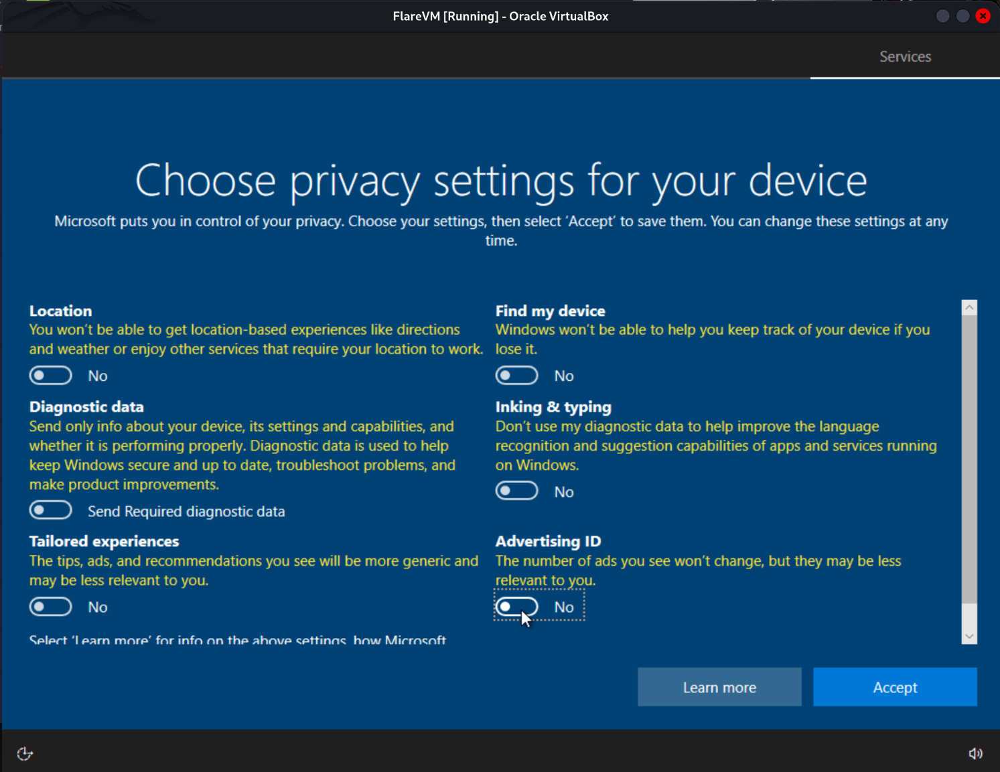

**5. Desktop Ready:**
Once the setup finishes, you will land on the Windows Desktop.
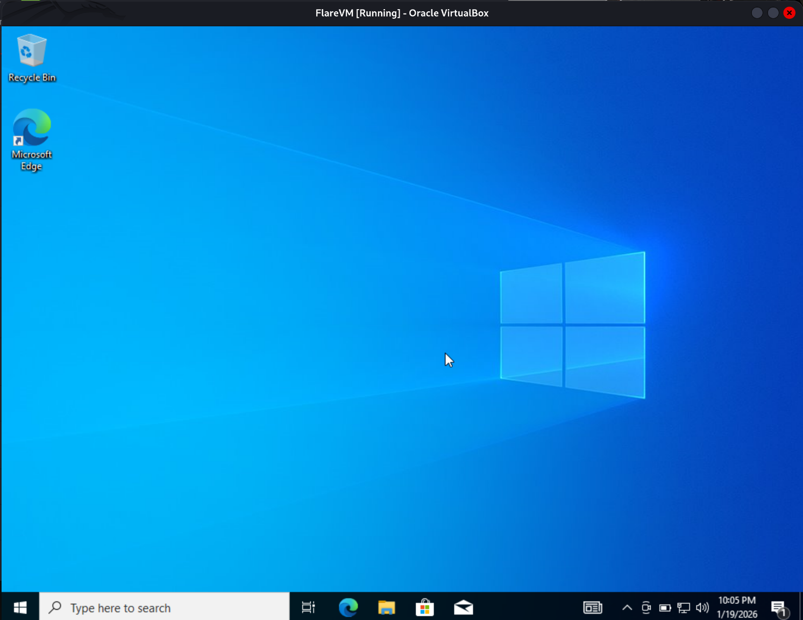

---

## Phase 4: System Preparation (Crucial)
**STOP!** Before installing FLARE-VM, you **must** permanently disable Windows Updates and Windows Defender via Group Policy. If you skip this, Windows will delete your tools and break the installation.

1.  Open **Windows Security** from the start menu to Turn off Microsoft Defender Antivirus Settings.
    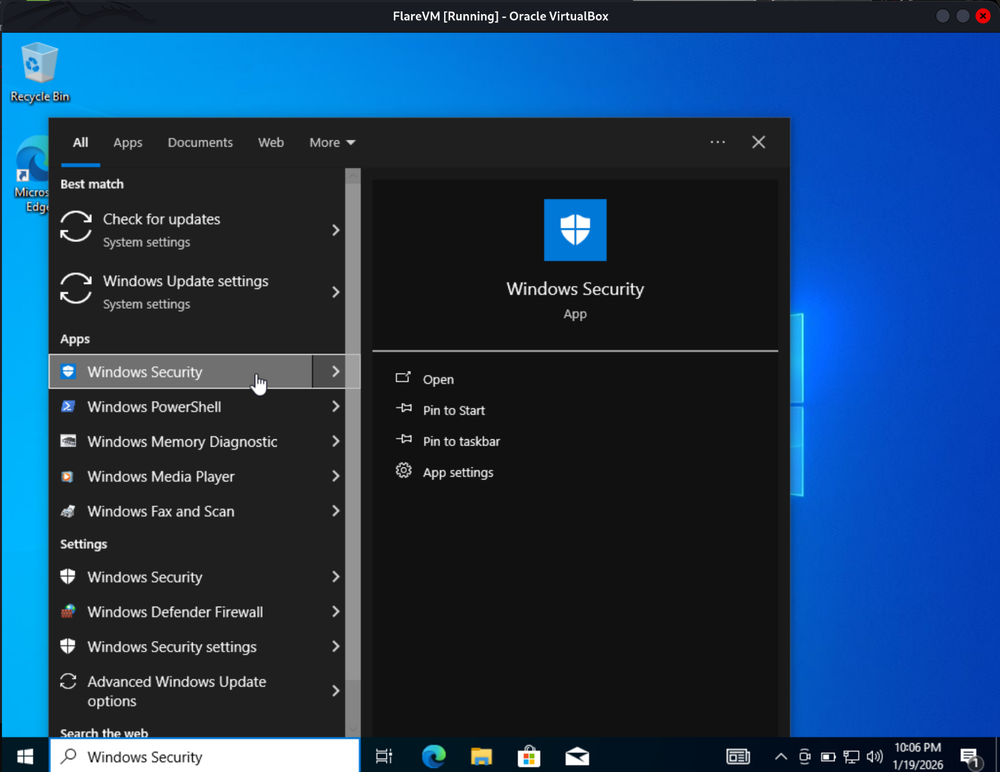

2.  Disable Microsoft Defender.
    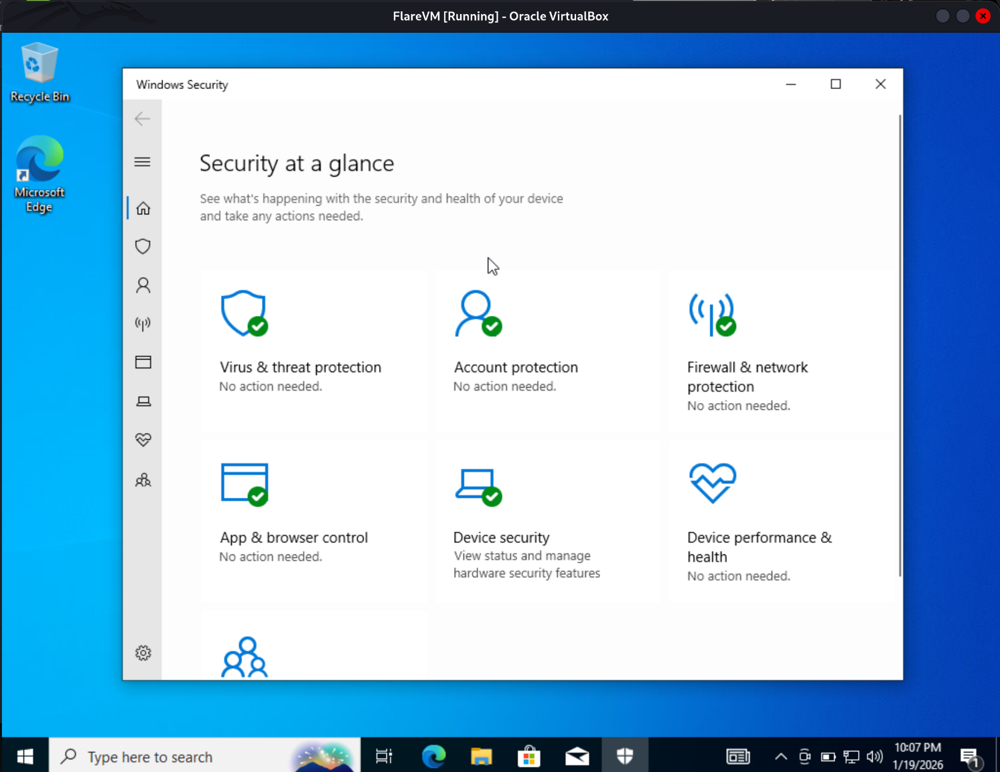

### Step A: Accessing Group Policy Editor
Instead of just using the settings menu (which Windows often turns back on), we will use the **Group Policy Editor** for a permanent fix.

1.  Click the Start button and type **"Edit group policy"**.
2.  Hit Enter to open it.
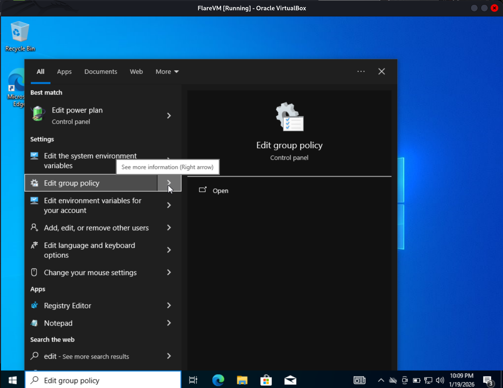

### Step B: Disable Automatic Updates
FLARE-VM installation takes a long time. If Windows decides to update and reboot in the middle, the installation will break.

1.  In the editor, go to:
    `Computer Configuration` > `Administrative Templates` > `Windows Components`
    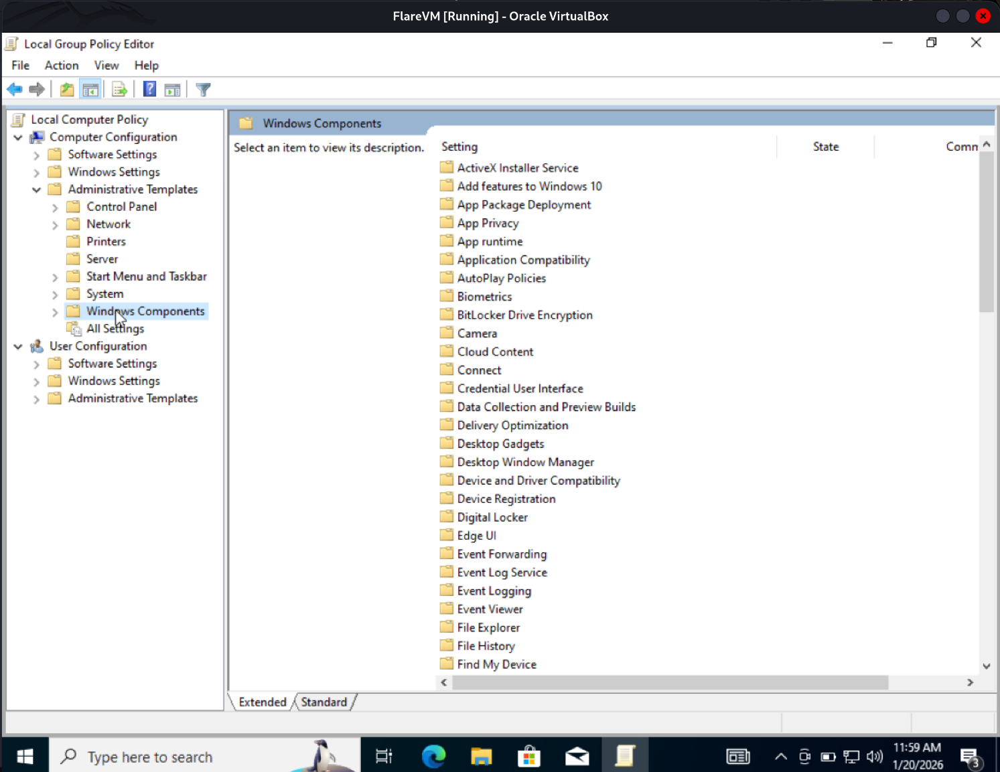

2.  Scroll down to find **Windows Update**.
3.  Double-click on **Configure Automatic Updates**.
    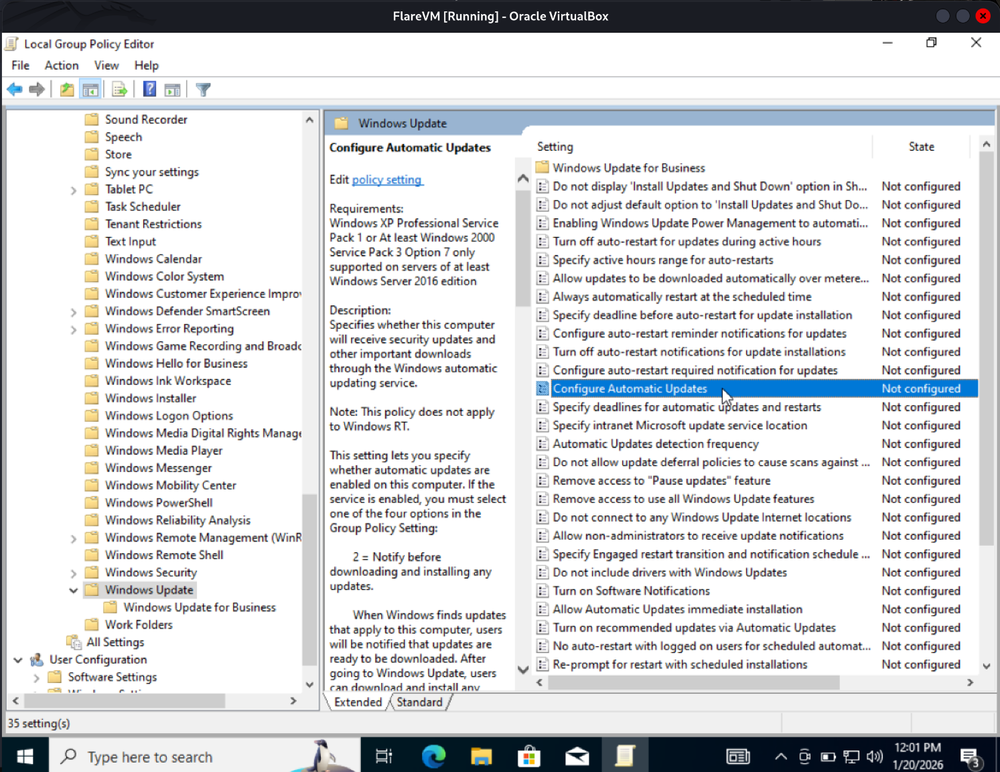

4.  Select **Disabled** and click **OK**.
    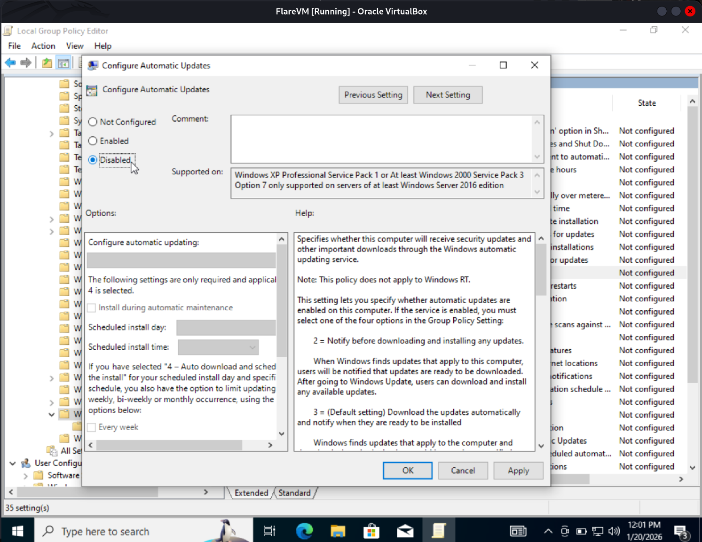

### Step C: Disable Microsoft Defender
Windows Defender is the enemy of this lab. It will flag your analysis tools as viruses.

1.  In the same "Windows Components" list, find **Microsoft Defender Antivirus**.
2.  Double-click on **Turn off Microsoft Defender Antivirus**.
3.  Set this to **Enabled** (this logic is tricky: "Enabled" means you are *enabling the Turn Off feature*). Click **OK**.
    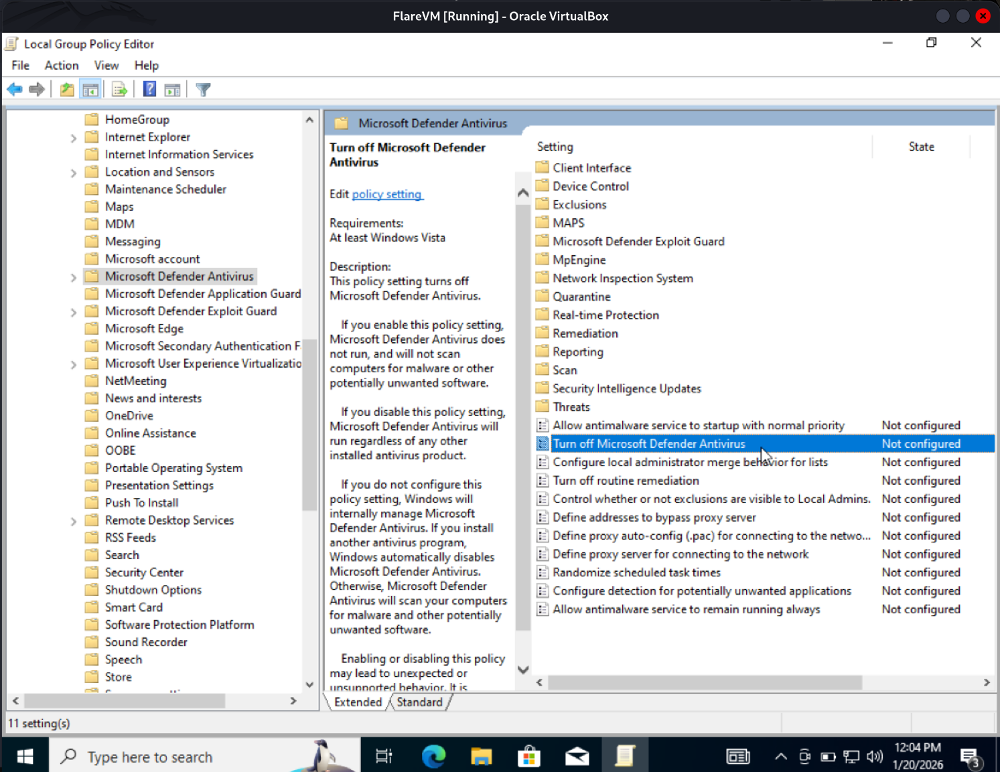

4.  **Extra Measure:** Go to the **Real-time Protection** folder (inside the Antivirus folder).
5.  Double-click **Turn off real-time protection** and set it to **Enabled**.
    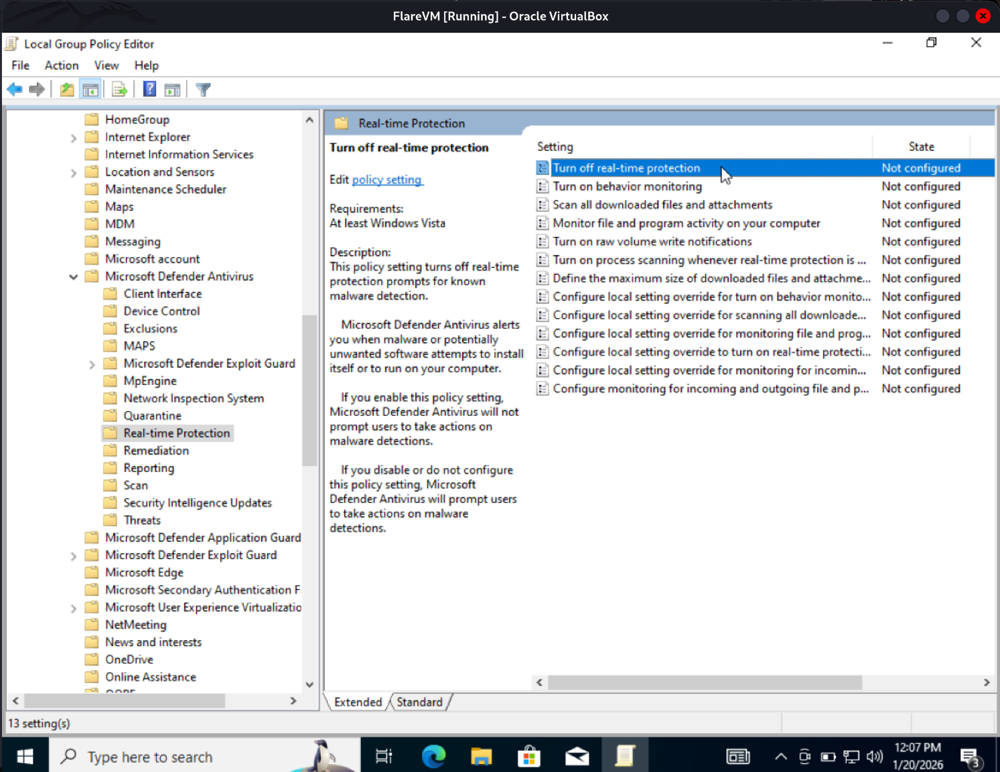

### Step D: Restart to Apply
Group Policies often require a restart to fully lock in. Restart your VM now before proceeding.
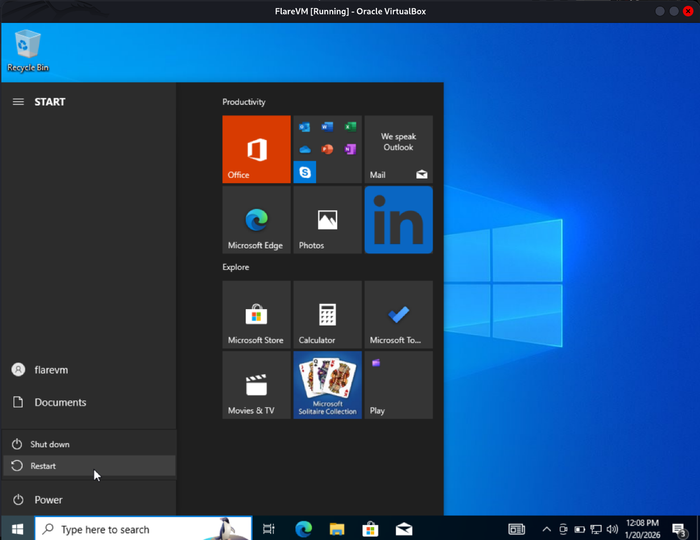

---

## Phase 5: Snapshot & Install
**1. Take a Snapshot:**
Now that Windows is configured but clean, go to your VirtualBox menu and take a **Snapshot**. Name it "Clean Base". If the installation fails, you can revert to this point instantly.

**2. Run the Installer:**
(Follow the standard installation instructions to download and run the `install.ps1` script).

